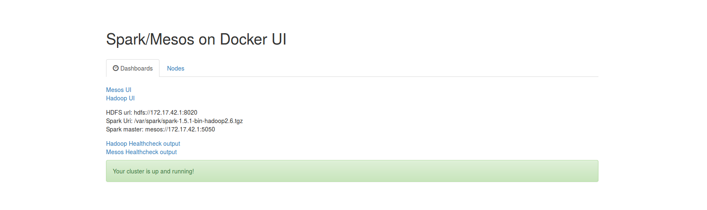

# Guide Spark on Mesos with Docker

The project sets up a cluster of the following components using docker:
- mesos (supported)
- spark (supported)
- hdfs (supported)
- zookeeper (supported)
- marathon (supported)

## Setup your host machine

We support OS X (latest) along with the following Ubuntu versions:

- Ubuntu 16.04 (Xenial)
- Ubuntu 15.04 (vivid)
- Ubuntu 14.04 (trusty)
- Ubuntu 12.04 (precise)

You will need to have installed the following libraries/programs on your host machine:
- wget
- python
- curl
- docker version >=1.8.3 see [here](https://docs.docker.com/engine/installation/) for detailed instructions:
- git
- sbt
- java 1.8
- maven
- latest mesos lib

On Ubuntu, you can install java Oracle 1.8, git, sbt and maven with the following script under util folder:

```sh
cd util
sudo su
./host_setup_ubuntu.sh
```

The script installs among others the latest Mesos library on the system and stops Mesos services on your localhost so that the cluster created later can run in net=host mode.

Note: There is no mesos official release for Ubuntu 16.04 yet:
http://stackoverflow.com/questions/37015871/not-able-to-install-mesos-on-ubuntu-16-04-desktop
In that case the script installs from the previous ubuntu version repo.

However, its better to
## Build the images or pull them

To build the docker Mesos image, change to the `build` directory and run:

```sh
cd ../build   # assuming you're in the `util` directory.
./build.sh 
```

Note: You can always build the image with your own repo:tag name and publish it as well.
Otherwise just run the script to build the
image from the default repo skonto/spark_mesos. Alternatively, you can just pull
the image with docker pull skonto/spark_mesos and skip building.

For the available options run: buildsh.sh -h or build.sh --help.

## Create the cluster
To run and configure your cluster execute `run.sh` in the `run` directory and use the appropriate options.

The most simple run is:

```sh
cd ../run   # assuming you're in the `build` directory.
./run.sh
```

which creates a simple cluster with 1 mesos master and 1 mesos slave
with the latest spark version installed.
Another common usage is:

```sh
./run.sh --number-of-slaves 3
```

It creates 3 slaves and one master.

Resource allocation is done according to a threshold for cpus and memory.
The default is 0.5 of all host resources if you do not specify any parameters.
For example if a cluster has 2 slaves on a host with 8 cpus and 8GB of ram
the 2 slaves will share 4 cpus and 4GB of ram approximately.
We take advantage of the static resource allocation strategy for mesos.
To change the allocation use the flags --mem-th and --cpu-th.
For the available options run: run.sh -h or run/sh --help.
The script by default checks if the latest spark binary is available if not tries
to download it. It is straightforward also to use a pre-existing binary like this:
```sh
./run.sh --spark-binary-file /home/stavros/workspace/installs/spark-1.5.1-bin-hadoop2.6.tgz
```
At the end of the script run a message is printed with url of the master for example:

Mesos cluster dashboard url http://172.17.42.1:5050

Also an html file is generated **index.html** which allows to access
several dashboards of the cluster components along with node info. See sample view
bellow:



### HDFS

Using the --with-hdfs flag you can setup a full hdfs system:
```sh
./run.sh --with-hdfs
```
To access the hadoop ui for example: http://172.17.42.1:50070.

Run the following command to see how many datanodes are running:

```sh
docker -it spm_master hdfs dfsadmin -report
```
Each mesos slave gets one datanode and the master has a namenode and a datanode.

Note: The result of the above command will not match the datanodes in the hadoop ui due
to a known [bug](https://issues.apache.org/jira/browse/HDFS-7303) for versions <2.7.
In buggy versions you can only see one datanode. This applies when datanodes are all created in localhost.

### Configuring Master and Slave explicitly

You can easily configure master and slaves with the following options,
--mesos-master-config, --mesos-slave-config.

```sh
./run.sh --mesos-master-config "--roles=role" --mesos-slave-config "--resources=cpus(role):8;mem(role):4000 --attributes=spark:only"
```

There are some restrictions though:
- Configurations for slaves are the same so it is not possible for each slave to have different attributes.
To support this would require orchestration capabilities (like in the ones found kubernetes) and it is not
needed as the goal is to test spark on mesos.
- Some properties are used to set the cluster to work correctly in docker net=host mode, so
changing their values may broken the set up. For example --ip is pre-configured to a specific value
so it is known in advance where to bind the master and this will not be discovered from the manual configuration.
Resources can be configured for the slaves but have in mind that they are the same for all slaves, you cannot allocate different ports per slave for example.
We give next which values are pre-configured through env variables:

```sh
#master:
-e "MESOS_EXECUTOR_REGISTRATION_TIMEOUT=5mins" \
-e "MESOS_ISOLATOR=cgroups/cpu,cgroups/mem" \
-e "MESOS_PORT=5050" \
-e "MESOS_LOG_DIR=/var/log" \
-e "MESOS_REGISTRY=in_memory" \
-e "MESOS_WORK_DIR=/tmp/mesos" \
-e "MESOS_CONTAINERIZERS=docker,mesos" \
```

```sh
#slave(s):
-e "MESOS_PORT=505$i" \
-e "MESOS_SWITCH_USER=false" \
-e "MESOS_RESOURCES=cpus(*):$cpus;mem(*):$mem" \
-e "MESOS_ISOLATOR=cgroups/cpu,cgroups/mem" \
-e "MESOS_EXECUTOR_REGISTRATION_TIMEOUT=5mins" \
-e "MESOS_CONTAINERIZERS=docker,mesos" \
-e "MESOS_LOG_DIR=/var/log" \
```
As it is clear mesos master/slave bind ports are auto allocated and there is no need to change.
Resources are overriden if specified at the command line by default.

## Using the cluster

Connecting from your host to the cluster is simple. To connect form spark repl
for example you need (assuming you are under the spark installation dir):
```sh
export SPARK_EXECUTOR_URI=/var/spark/spark-1.5.1-bin-hadoop2.6.tgz

./spark-shell --master mesos://172.17.42.1:5050  
```
If you assign one cpu per slave then you need to set:
--conf spark.mesos.mesosExecutor.cores=0

because mesosExecutor reserves by default 1 cpu and otherwise the job will not
have enough resources.

Another way to use the cluster is to submit a regular spark job.
For example you could do in client mode:
```sh
export SPARK_EXECUTOR_URI=/var/spark/spark-1.5.1-bin-hadoop2.6.tgz

./bin/spark-submit   --class org.apache.spark.examples.SparkPi   --master mesos://172.17.42.1:5050  /path_to_spark_home/lib/spark-examples-1.5.1-hadoop2.6.0.jar  100
```
Or in cluster mode:

```sh
export SPARK_EXECUTOR_URI=/var/spark/spark-1.5.1-bin-hadoop2.6.tgz

#start mesos dispatcher
 export SPARK_MESOS_DISPATCHER_HOST=172.17.42.1
./sbin/start-mesos-dispatcher.sh --master mesos://172.17.42.1:5050

#copy job jar to hdfs
docker cp  /path_to_spark_home/lib/spark-examples-1.5.1-hadoop2.6.0.jar spm_master:/var/spark
docker exec -it spm_master hadoop fs -copyFromLocal /var/spark/spark-examples-1.5.1-hadoop2.6.0.jar hdfs://172.17.42.1:8020/examples.jar

#submit the job
./bin/spark-submit --class org.apache.spark.examples.SparkPi --master mesos://172.17.42.1:7077 --deploy-mode cluster  hdfs://172.17.42.1:8020/examples.jar  100
```

### Destroying the cluster

Every time you create a new cluster the script by default removes any previous one running.
If you want to explicitly remove a running cluster just use the cluster_remove.sh
script:

```sh
./cluster_remove.sh
```

### Mesos Roles And Attributes with Spark

You can configure roles for slaves and attributes as follows:

```sh
./run.sh --mesos-master-config "--roles=role" --mesos-slave-config "--attributes=spark:only"
```

and connect to the master as follows:

```sh
./spark-shell --master mesos://172.17.42.1:5050 --conf spark.mesos.role=role --conf spark.mesos.constraints="spark:only"
```


Alternatively you can use the slaves-config.json.template file to
pass different configurations per slave. For now only resources and atrributes
are supported. We use the jq utility available both in Ubuntu and OS X.
An example of using the file would be:

```sh
./run.sh --mesos-master-config "--roles=spark_role" --slaves-cfg-file slaves-config.json.template
```

Note: Using a configuration file overrides the number of slaves started and takes precedence over --number-of-slaves or the default value.

### Setting docker mesos lib version

By default docker images should have the latest mesos library as it is defined here:
http://mesos.apache.org/downloads/.

If there is an issue with some mesos release you can always fallback by setting the docker mesos lib version
through either command line with the parameter *update-image-mesos-at-version* or through the environmental variable
*MIT_DOCKER_MESOS_VERSION*.
This assumes you have set the appropriate version on your host machine as well.

Note: Ubuntu images use ubuntu repositories to fetch mesos libraries, this may change in the future if
repositories are not updated regularly.
